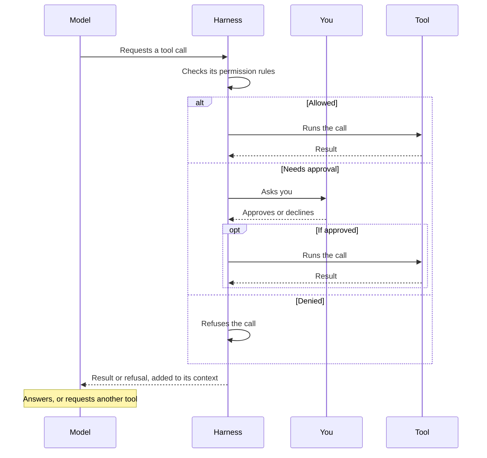

<!-- Shared asset, included by content/concepts/tool-call-loop.md and content/slides/tool-call-loop.md. See maintainers/MAINTAINING.md#website. -->

```mermaid
sequenceDiagram
    participant M as Model
    participant H as Harness
    participant U as You
    participant T as Tool
    M->>H: Requests a tool call
    H->>H: Checks its permission rules
    alt Allowed
        H->>T: Runs the call
        T-->>H: Result
    else Needs approval
        H->>U: Asks you
        U-->>H: Approves or declines
        opt If approved
            H->>T: Runs the call
            T-->>H: Result
        end
    else Denied
        H->>H: Refuses the call
    end
    H-->>M: Result or refusal, added to its context
    Note over M: Answers, or requests another tool
```
